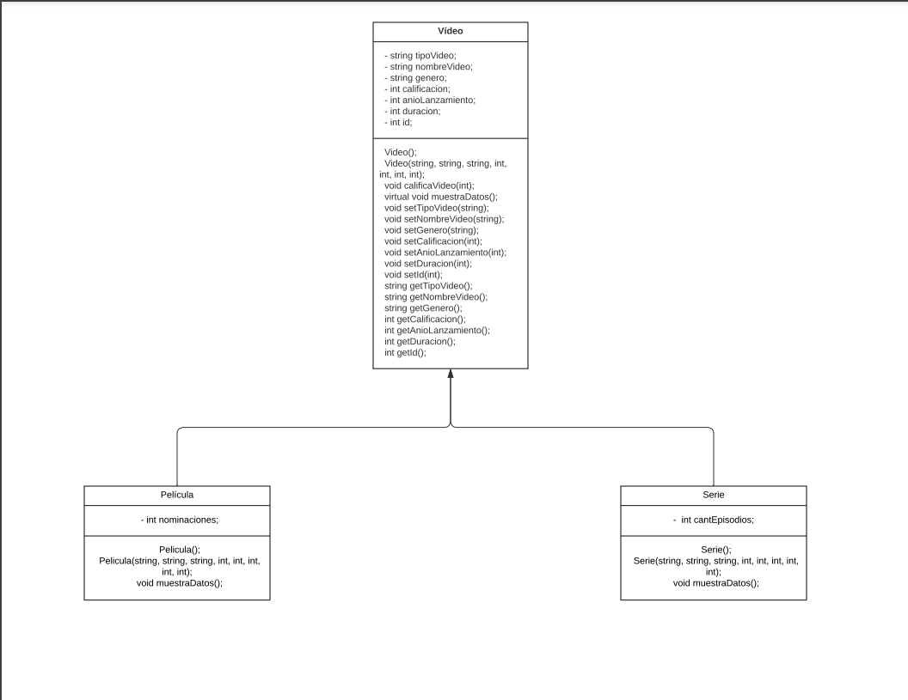

# Proyecto Integrador

### Build #1

Fecha - 16 de Mayo del 2024

Mi proyecto en C++ define una clase llamada Video que encapsula información sobre un video, como su tipo, nombre, género, calificación, año de lanzamiento y duración. Uso esta clase para crear un objeto vid1 con valores específicos y luego muestro estos detalles en la consola. Básicamente, mi programa permite crear instancias de objetos Video, asignarles valores y mostrar esa información al usuario. Para esto, uso un constructor parametrizado para la creación del objeto y un método muestraDatos para imprimir la información del video.

- [x] Uso de Clases.
- [x] Uso de atributos.
- [x] Uso de métodos.

### Build #2

Fecha - 30 de Mayo del 2024

Se realizaron varias actualizaciones para mejorar la estructura y funcionalidad del código. Se creó una clase abstracta y padre llamada Video en el archivo , la cual define una interfaz común para todos los tipos de videos y contiene métodos virtuales puros. La implementación básica de estos métodos se encuentra en . Se desarrollaron dos clases derivadas, Pelicula y Serie, que heredan de Video. Las declaraciones de Pelicula se encuentran en y su implementación en , garantizando la sobrescritura adecuada del método muestraDatos. De manera similar, Serie se definió en y se implementó en . Finalmente, el archivo se actualizó para incluir y utilizar estas nuevas clases, creando instancias de Pelicula y Serie, y llamando a sus métodos muestraDatos. Estas mejoras no solo solucionan errores previos de referencia indefinida, sino que también organizan el código de acuerdo con los principios de la programación orientada a objetos.

- [x] Poliformismo
- [x] Herencia
- [x] Atributos y objetos

# ¿Quién Soy?

Nombre - Emilio Antonio Peralta Montiel

Instituto Tecnológico y de Estudios Superiores de Monterrey

# Contacto

E-Mail 

a01712354@tec.mx
